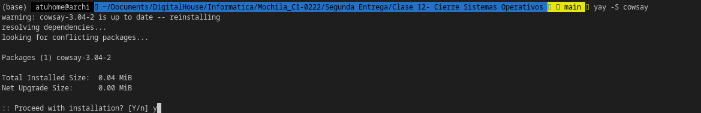
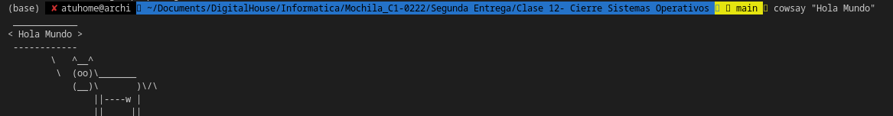
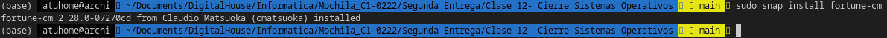
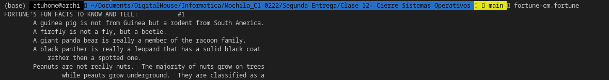
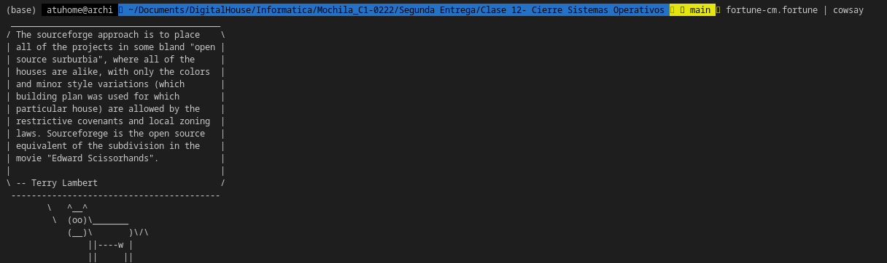

**¿Que es un usuario root en
Linux?**

>1- El usuario root en GNU/Linux es el usuario que tiene acceso administrativo al sistema. 

**¿Por qué ubuntu no me deja establecer la contraseña durante la
instalación?**

>Cuando instalas ubuntu, se te pide que crees un usuario para ti. Esto se debe a que es desaconsejable ejecutar el sistema como root, ya que éste siempre tiene todos los permisos y los programas ejecutados como root pueden hacer lo que quieran, lo que supone un riesgo para la seguridad. 
Ubuntu">ubuntu es ligeramente diferente de muchas otras distros de linux en su enfoque, porque desactiva el inicio de sesión como root al no establecer una contraseña para el mismo. En muchos sistemas Linux, cuando quieres elevar los privilegios, te conviertes en el usuario root escribiendo su - o simplemente su en una terminal. El su (cambiar de usuario) le permite entrar como otro usuario en un Shell. Debe introducir la contraseña del usuario con el que quiere iniciar la sesión, no la suya propia. En Ubuntu su falla porque root no tiene contraseña. Puede "arreglar" esto estableciendo una contraseña para root, pero se desaconseja y no es necesario ya que sudo proporciona todos los privilegios. Incluso puede ejecutar el su como root escribiendo sudo su . A continuación, escribe su propia contraseña y se convierte en root. Sin embargo, como sudo proporciona una manera de abrir un Shell root no hay necesidad de ejecutar el su con él para este fin. Puede utilizar simplemente sudo -i .

**¿Cuáles son los procesos típicos de Linux?¿Cómo identificarlos?**

>Los principales estados en los que pueden encontrarse los procesos en Linux/Unix son los siguientes: running (R) : Procesos que están en ejecución. sleeping (S) : Procesos que están esperando su turno para ejecutarse. waiting (W) : Procesos que están esperando a que otro proceso termine. stopped (T) : Procesos que han sido detenidos. zombie (Z) : Procesos que han sido terminados, pero que no han sido eliminados.
Procesos en Linux:

    * Procesos Normales.
    * Procesos Daemon.
    * Procesos Zombie.

 

●Investigar y establecer una contraseña para el usuarioroot.
>

●Escribiren la terminal el comandoapt install cowsay.
<<<<<<< HEAD
>
=======
>
>>>>>>> main
●Escribir en la terminal el comandocowsay “ Hola mundo “.
>

●Escribiren la terminal el comandosudo apt install fortune
>

●Escribir en la terminal fortune.
>
●fortune | cowsay
>

